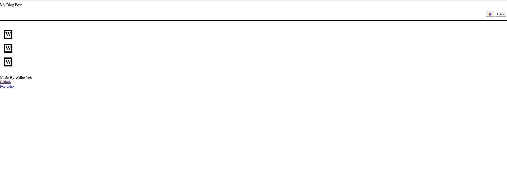

# FirstblogHTMLJavascript

The blog post initially has a place where you can input your username, title, and comment section. The form if a part is left blank will give an alert saying you have to fill in blank space. There is also a place where you can change light and dark mode. Once the form is submitted it will post into the blog section. There is a back button where it will take you back to form to fill out to allow for another blog post to be posted. The light and dark mode is using css to change background and font color. The footer has links to go to different webpages that are listed on there.

deployment: https://willieyeh1.github.io/FirstblogHTMLJavascript/
